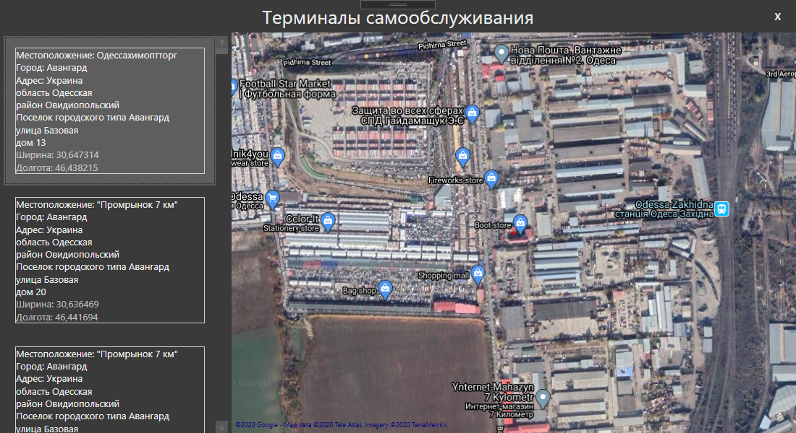

# Практика второго курса
Практика второго курса, вариант 7
## Цель данного проекта
Целью выполнения данного проекта является получение первичных профессиональных умений и навыков на примере решения реальной задачи по разработке программной системы.

По задания необходимо было получить наименования всех городов, где расположены терминалы самообслуживания данного банка, отсортировать их по алфавиту и сохранить в текстовых файлах в кодировках UTF-8, UTF-16 (Unicode)
## Разработка проекта
Для разработки данного проекта был выбран язык C#. Для реализации карты использовалась библиотека GMap, сериализация и десериализация результатов запросов к серверу производилась с помощью библиотеки Newtonsoft.Json.
## Содержание проекта
```
│   .gitignore                  --список файлов и папок для скрытия от системы контроля версий
│   App.config  
│   App.xaml                    --стартовая точка приложения
│   App.xaml.cs
│   CustomListViewItem.xaml     --пользовательский элемент управления (элемент списка ListView)
│   CustomListViewItem.xaml.cs  --код пользовательского элемента управления
│   JsonResponse.cs             --класс описывающий элемент ответа от сервера
│   MainWindow.xaml             --главное окно приложения
│   MainWindow.xaml.cs          --код главного окна приложения
│   packages.config             --файл хранящий список необходимых библиотек с их используемой версией
│   Pract.csproj
│   Pract.sln
│
└───Properties
        AssemblyInfo.cs
        Resources.Designer.cs
        Resources.resx
        Settings.Designer.cs
        Settings.settings
```
## Изображения проекта
<p align="center">
  <b>Главное окно приложения</b>
</p>
<p align="center">
  
</p>
